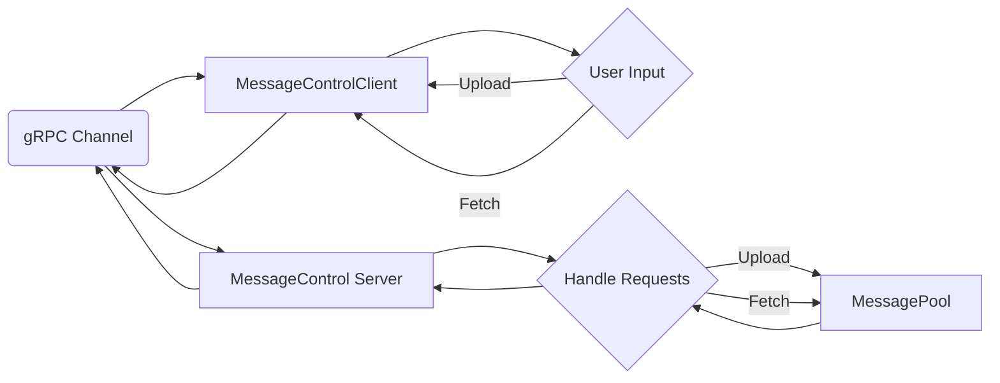

# 分布式系统_HW3

*21307289 刘森元*

## 1. 理论题

### 1) 为什么传输层通信服务往往不适合构建分布式应用程序？

传输层通信服务（如TCP和UDP）通常不适合构建分布式应用程序，原因如下：

1. 连接管理：传输层通信服务通常基于点对点连接模型，需要在通信双方维护连接状态。在分布式环境中，连接管理变得更加复杂，因为存在多个节点之间的连接和状态维护，这可能导致性能下降和复杂性增加。

2. 可靠性保证：传输层通信服务提供了可靠的数据传输，确保数据的完整性和有序性。然而，在分布式环境中，网络延迟、丢包和节点故障等问题更加常见，这可能导致传输层协议的性能下降，甚至导致通信失败。

3. 扩展性：传输层通信服务通常是基于点对点连接的，这限制了系统的扩展性。在分布式应用程序中，节点数量可能非常大，而且节点的动态加入和离开是常见的情况。传输层通信服务往往无法有效地处理这种动态性和规模性。

为了构建分布式应用程序，通常会使用更高层次的协议和技术，如消息队列、分布式消息传递、发布-订阅模式等。这些技术能够更好地适应分布式环境的需求，提供更好的可扩展性、容错性和性能。

### 2) 描述一下客户端和服务器端之间使用套接字的无连接通信是如何进行的?

在客户端和服务器端之间使用套接字进行无连接通信时，基本步骤为：

1. 服务器端创建套接字并绑定到一个特定的IP地址和端口号上。

2. 客户端创建一个套接字，并指定服务器的IP地址和端口号。

3. 客户端通过套接字向服务器发送数据包，无需在事先建立连接。

4. 服务器端监听指定的端口，等待客户端的请求。

5. 服务器接收到客户端发送的数据包后，对数据进行处理。

6. 服务器通过套接字向客户端发送响应数据包，同样无需建立连接。

7. 客户端接收到服务器端的响应数据包后，进行处理。

在无连接通信中，每个数据包都是独立的，没有持久的连接状态。客户端和服务器端之间的通信是通过发送和接收数据包来实现的，而不需要在事先建立连接或维护连接状态。

### 3) 假定客户通过异步RPC对服务器进行调用，随后等待服务器使用另一异步RPC返回结在客户通过异步RPC调用服务器并等待另一异步RPC返回结果的情况下，与客户执行常规的RPC相比，有以下不同之处：

1. 异步性质：异步RPC允许客户端在发起调用后继续执行其他任务，而无需等待服务器返回结果。客户端可以并发执行多个异步调用，从而提高系统的吞吐量和性能。相比之下，常规的RPC是同步的，客户端需要等待服务器返回结果后才能继续执行后续操作。

2. 非阻塞调用：异步RPC调用是非阻塞的，客户端可以继续执行其他任务，而不会被RPC调用阻塞。客户端可以利用这种非阻塞特性，在等待服务器结果期间执行其他计算或IO操作。常规的RPC调用是阻塞的，客户端在等待服务器返回结果时会被阻塞，无法执行其他任务。

3. 回调机制：异步RPC通常使用回调机制来处理服务器返回的结果。客户端在发起异步调用时，提供一个回调函数作为参数，服务器在完成处理后调用该回调函数，将结果传递给客户端。这种方式可以灵活地处理服务器返回结果，而常规的RPC通常是直接返回结果给客户端。

如果使用同步RPC而不是异步RPC，情况会有所不同：

1. 阻塞调用：同步RPC调用是阻塞的，客户端在发起调用后会一直阻塞，直到服务器返回结果。客户端无法继续执行其他任务，直到收到服务器的响应。

2. 顺序执行：由于同步RPC是阻塞的，客户端需要等待每个RPC调用的结果，因此无法并发执行多个RPC调用。每个RPC调用都必须按顺序执行，这可能会导致较低的系统吞吐量和性能。

总而言之，异步RPC允许客户端在发起调用后继续执行其他任务，而无需等待服务器返回结果，具有更高的并发性和非阻塞特性。而同步RPC是阻塞的，需要等待服务器返回结果后才能继续执行后续操作，无法并发执行多个RPC调用。果。这种方法与客户执行常规的RPC有没有什么不同？如果使用的是同步RPC而不是异步RPC，情况如何？

### 4) 假定只能使用瞬时同步通信原语，如何实现用于瞬时异步通信的原语？

如果只能使用瞬时同步通信原语，而需要实现瞬时异步通信的原语，可以借助一些技术和模式来实现，如下所示：

1. 轮询（Polling）：客户端可以定期向服务器发送请求，然后立即返回并继续执行其他任务。服务器在接收到请求后进行处理，并将结果存储在某个共享区域中。客户端可以定期轮询该共享区域，以检查是否有结果可用。这样，客户端可以在等待结果的同时执行其他任务。

2. 回调（Callback）：客户端可以在发起请求时，提供一个回调函数给服务器。服务器在处理请求后，调用该回调函数并传递结果给客户端。客户端可以继续执行其他任务，而不需要等待服务器的响应。这种方式利用回调机制实现了异步通信。

3. 事件驱动（Event-driven）：客户端和服务器之间可以使用事件驱动的机制进行通信。客户端可以注册感兴趣的事件，当事件发生时，服务器会触发相应的回调函数来通知客户端。这种方式可以实现异步通信，而不需要显式的轮询或阻塞等待。

需要注意的是，使用瞬时同步通信原语来实现瞬时异步通信可能会引入一些复杂性和性能开销。因为瞬时同步原语本身是阻塞的，所以需要通过轮询、回调或事件驱动等方式来模拟异步行为。这可能会增加系统的复杂性，并且在轮询的过程中可能会消耗一些额外的资源。因此，如果可能，使用原生的异步通信机制（如异步RPC）可能更为高效和简单。

## 2. 实验题

> 使用protobuf和gRPC等远程过程调用的方法实现消息订阅（publish-subscribe）系统，该订阅系统能够实现简单的消息传输，还可以控制消息在服务器端存储的时间。

### 实验环境

Macbook Pro 2021, Apple M1 Pro, Apple Silicon, ARM64/v8

macOS Ventura 13.5.2

Python 3.11.6

grpcio 1.59.0

libprotoc 24.3

### 实验步骤

**以下涉及完整代码请翻看文末**

在进行必要的前置知识获取后：

- [Protobuf](https://protobuf.dev/programming-guides/proto3/)
- [gRPC](https://grpc.io/docs/languages/python/basics/)

就可构建出大致程序大致框架



根据框架可写出 *MessageControl.proto*

```protobuf
syntax = "proto3";

// 定义MessageControl服务
service MessageControl {
    // 上传消息的RPC方法
    rpc Upload(UploadRequest) returns (UploadResponse) {}
    // 获取消息的RPC方法
    rpc Fetch(FetchRequest) returns (FetchResponse) {}
}

// 上传消息的请求消息类型
message UploadRequest {
    string UUID = 1; // UUID，用于标识消息的唯一ID
    string Message = 2; // 消息内容
    int32 RemainTime = 3; // 消息剩余时间
}

// 上传消息的响应消息类型
message UploadResponse {
    string Message = 1; // 响应消息，表示上传结果
}

// 获取消息的请求消息类型
message FetchRequest {
    string UUID = 1; // UUID，用于标识消息的唯一ID
}

// 获取消息的响应消息类型
message FetchResponse {
    string Message = 1; // 响应消息，表示获取到的消息内容
}
```

以及 `Fetch/Upload` 方法

```python
# 实现Upload方法，用于上传消息
def Upload(self, Request, Context):
    uuid, Message, RemainTime = Request.UUID, Request.Message, Request.RemainTime
    if uuid not in self.MessagePool:  # 如果UUID不在消息池中，添加一个空的消息列表
        self.MessagePool[uuid] = []
    timestamp = int(time.time())  # 获取当前时间戳
    self.MessagePool[uuid].append(
        (timestamp + RemainTime, Message))  # 将消息添加到对应的消息列表中
    return MessageControl_pb2.UploadResponse(
        Message=f'{uuid}\'s message successfully uploaded!')

# 实现Fetch方法，用于获取消息
def Fetch(self, Request, Context):
    uuid = Request.UUID
    if uuid not in self.MessagePool or len(
            self.MessagePool[uuid]) == 0:  # 如果UUID不在消息池中或者消息列表为空，返回相应的提示信息
        return MessageControl_pb2.FetchResponse(
            Message=f'{uuid} have no messages')
    context = f'{uuid} have messages belowing:'
    self.Fresh(uuid)  # 调用Fresh方法，清除过期的消息
    for it in range(len(self.MessagePool[uuid])):  # 遍历消息列表，构建返回的消息内容
        context += f'\nMessage {it}: {self.MessagePool[uuid][it][1]}\nDeadtime:  {datetime.datetime.fromtimestamp(self.MessagePool[uuid][it][0]).strftime("%Y-%m-%d %H:%M:%S")}'
    return MessageControl_pb2.FetchResponse(Message=context)
```

### gRPC服务搭建

首先进行必要环境安装

```shell
pip install grpcio grpcio-tools
```

编译 `MessageControl.proto` 文件

```shell
python -m grpc_tools.protoc -I . --python_out=. --grpc_python_out=. MessageControl.proto
```

进行双端服务编写

```python
# 定义serve函数，用于启动gRPC服务器
def serve():
    server = grpc.server(futures.ThreadPoolExecutor())  # 创建gRPC服务器
    Handler = MessageControlServicer()  # 创建MessageControlServicer实例
    MessageControl_pb2_grpc.add_MessageControlServicer_to_server(
        Handler, server)  # 将MessageControlServicer注册到服务器中
    server.add_insecure_port('[::]:50051')  # 指定服务器监听的端口
    server.start()  # 启动服务器
    print('Waiting for requests...')
    server.wait_for_termination()  # 等待请求的到来并处理
```

```python
# 运行函数，建立与gRPC服务器的通信，并根据用户输入进行消息的上传和获取
def run():
    global uuid
    channel = grpc.insecure_channel('localhost:50051')  # 创建与gRPC服务器的通信通道
    stub = MessageControl_pb2_grpc.MessageControlStub(channel)  # 创建gRPC客户端存根
    while True:
        message = input(
            'Input message (\'fetch\' to fetch messages, \'quit\' to quit): '
        )  # 用户输入消息内容
        if message == 'fetch':  # 如果输入为'fetch'，则获取消息
            print(
                stub.Fetch(MessageControl_pb2.FetchRequest(
                    UUID=uuid)).Message)  # 调用Fetch方法获取消息
            continue
        if message == 'quit':  # 如果输入为'quit'，则退出程序
            return
        remain = int(input('Input message remaining time: '))  # 用户输入消息的剩余时间
        request = MessageControl_pb2.UploadRequest(
            UUID=uuid, Message=message, RemainTime=remain)  # 构建上传消息的请求对象
        reponse = stub.Upload(request)  # 调用Upload方法上传消息
        print(reponse.Message)  # 打印上传结果
```

### 用户识别

使用本地储存uuid的方式来识别用户

```python
# 获取UUID，如果已存在则从配置文件中读取，否则生成新的UUID并存储到配置文件中
def getUUID():
    global uuid
    current_dir = os.path.dirname(os.path.abspath(__file__))
    config_file_path = os.path.join(current_dir, "config.json")

    if os.path.exists(config_file_path):
        with open(config_file_path, "r") as file:
            config_data = json.load(file)
            uuid = str(config_data.get("uuid"))
            if uuid:
                print(f"UUID found: {uuid}")
                return

    uuid = str(uuid.uuid4())
    config_data = {"uuid": uuid}
    with open(config_file_path, "w") as file:
        json.dump(config_data, file)
        print(f"New UUID generated and stored in config.json: {uuid}")
```

### 运行结果

*Server.py*


*Client.py*


可见信息能够分用户存储并且自定义存活时间

### 完整代码

*MessageControl.proto*

```protobuf
syntax = "proto3";

// 定义MessageControl服务
service MessageControl {
    // 上传消息的RPC方法
    rpc Upload(UploadRequest) returns (UploadResponse) {}
    // 获取消息的RPC方法
    rpc Fetch(FetchRequest) returns (FetchResponse) {}
}

// 上传消息的请求消息类型
message UploadRequest {
    string UUID = 1; // UUID，用于标识消息的唯一ID
    string Message = 2; // 消息内容
    int32 RemainTime = 3; // 消息剩余时间
}

// 上传消息的响应消息类型
message UploadResponse {
    string Message = 1; // 响应消息，表示上传结果
}

// 获取消息的请求消息类型
message FetchRequest {
    string UUID = 1; // UUID，用于标识消息的唯一ID
}

// 获取消息的响应消息类型
message FetchResponse {
    string Message = 1; // 响应消息，表示获取到的消息内容
}
```

*Server.py*

```python
import grpc
import MessageControl_pb2
import MessageControl_pb2_grpc
from concurrent import futures
import time
import datetime


# 定义MessageControlServicer类，用于实现gRPC服务端的逻辑
class MessageControlServicer(MessageControl_pb2_grpc.MessageControlServicer):

    def __init__(self):
        self.MessagePool = dict()  # 存储消息的字典，以UUID为键，消息列表为值

    # 实现Upload方法，用于上传消息
    def Upload(self, Request, Context):
        uuid, Message, RemainTime = Request.UUID, Request.Message, Request.RemainTime
        if uuid not in self.MessagePool:  # 如果UUID不在消息池中，添加一个空的消息列表
            self.MessagePool[uuid] = []
        timestamp = int(time.time())  # 获取当前时间戳
        self.MessagePool[uuid].append(
            (timestamp + RemainTime, Message))  # 将消息添加到对应的消息列表中
        return MessageControl_pb2.UploadResponse(
            Message=f'{uuid}\'s message successfully uploaded!')

    # 实现Fetch方法，用于获取消息
    def Fetch(self, Request, Context):
        uuid = Request.UUID
        if uuid not in self.MessagePool or len(
                self.MessagePool[uuid]) == 0:  # 如果UUID不在消息池中或者消息列表为空，返回相应的提示信息
            return MessageControl_pb2.FetchResponse(
                Message=f'{uuid} have no messages')
        context = f'{uuid} have messages belowing:'
        self.Fresh(uuid)  # 调用Fresh方法，清除过期的消息
        for it in range(len(self.MessagePool[uuid])):  # 遍历消息列表，构建返回的消息内容
            context += f'\nMessage {it}: {self.MessagePool[uuid][it][1]}\nDeadtime:  {datetime.datetime.fromtimestamp(self.MessagePool[uuid][it][0]).strftime("%Y-%m-%d %H:%M:%S")}'
        return MessageControl_pb2.FetchResponse(Message=context)

    # 实现Fresh方法，用于清除过期的消息
    def Fresh(self, uuid):
        timestamp = int(time.time())  # 获取当前时间戳
        self.MessagePool[uuid].sort(reverse=True)  # 按照消息的过期时间进行排序（降序）
        counter = 0
        while len(self.MessagePool[uuid]) != 0 and self.MessagePool[uuid][-1][
                0] < timestamp:  # 当消息列表不为空且最后一条消息的过期时间小于当前时间戳时，删除该消息
            self.MessagePool[uuid].pop()
            counter += 1
        if counter != 0:
            print(
                f'Delete {counter} outdated messages of {uuid}')  # 打印删除过期消息的数量
        return


# 定义serve函数，用于启动gRPC服务器
def serve():
    server = grpc.server(futures.ThreadPoolExecutor())  # 创建gRPC服务器
    Handler = MessageControlServicer()  # 创建MessageControlServicer实例
    MessageControl_pb2_grpc.add_MessageControlServicer_to_server(
        Handler, server)  # 将MessageControlServicer注册到服务器中
    server.add_insecure_port('[::]:50051')  # 指定服务器监听的端口
    server.start()  # 启动服务器
    print('Waiting for requests...')
    server.wait_for_termination()  # 等待请求的到来并处理


if __name__ == '__main__':
    serve()  # 启动服务器
```

*Client.py*

```python
import grpc
import MessageControl_pb2
import MessageControl_pb2_grpc
import os
import json
import uuid

uuid = str()


# 获取UUID，如果已存在则从配置文件中读取，否则生成新的UUID并存储到配置文件中
def getUUID():
    global uuid
    current_dir = os.path.dirname(os.path.abspath(__file__))
    config_file_path = os.path.join(current_dir, "config.json")

    if os.path.exists(config_file_path):
        with open(config_file_path, "r") as file:
            config_data = json.load(file)
            uuid = str(config_data.get("uuid"))
            if uuid:
                print(f"UUID found: {uuid}")
                return

    uuid = str(uuid.uuid4())
    config_data = {"uuid": uuid}
    with open(config_file_path, "w") as file:
        json.dump(config_data, file)
        print(f"New UUID generated and stored in config.json: {uuid}")


# 运行函数，建立与gRPC服务器的通信，并根据用户输入进行消息的上传和获取
def run():
    global uuid
    channel = grpc.insecure_channel('localhost:50051')  # 创建与gRPC服务器的通信通道
    stub = MessageControl_pb2_grpc.MessageControlStub(channel)  # 创建gRPC客户端存根
    while True:
        message = input(
            'Input message (\'fetch\' to fetch messages, \'quit\' to quit): '
        )  # 用户输入消息内容
        if message == 'fetch':  # 如果输入为'fetch'，则获取消息
            print(
                stub.Fetch(MessageControl_pb2.FetchRequest(
                    UUID=uuid)).Message)  # 调用Fetch方法获取消息
            continue
        if message == 'quit':  # 如果输入为'quit'，则退出程序
            return
        remain = int(input('Input message remaining time: '))  # 用户输入消息的剩余时间
        request = MessageControl_pb2.UploadRequest(
            UUID=uuid, Message=message, RemainTime=remain)  # 构建上传消息的请求对象
        reponse = stub.Upload(request)  # 调用Upload方法上传消息
        print(reponse.Message)  # 打印上传结果


if __name__ == '__main__':
    getUUID()  # 获取或生成UUID
    run()  # 运行程序
```

*MessageControl_pb2.py*

```python
# -*- coding: utf-8 -*-
# Generated by the protocol buffer compiler.  DO NOT EDIT!
# source: MessageControl.proto
"""Generated protocol buffer code."""
from google.protobuf import descriptor as _descriptor
from google.protobuf import descriptor_pool as _descriptor_pool
from google.protobuf import symbol_database as _symbol_database
from google.protobuf.internal import builder as _builder
# @@protoc_insertion_point(imports)

_sym_db = _symbol_database.Default()


DESCRIPTOR = _descriptor_pool.Default().AddSerializedFile(b'\n\x14MessageControl.proto\"B\n\rUploadRequest\x12\x0c\n\x04UUID\x18\x01 \x01(\t\x12\x0f\n\x07Message\x18\x02 \x01(\t\x12\x12\n\nRemainTime\x18\x03 \x01(\x05\"!\n\x0eUploadResponse\x12\x0f\n\x07Message\x18\x01 \x01(\t\"\x1c\n\x0c\x46\x65tchRequest\x12\x0c\n\x04UUID\x18\x01 \x01(\t\" \n\rFetchResponse\x12\x0f\n\x07Message\x18\x01 \x01(\t2g\n\x0eMessageControl\x12+\n\x06Upload\x12\x0e.UploadRequest\x1a\x0f.UploadResponse\"\x00\x12(\n\x05\x46\x65tch\x12\r.FetchRequest\x1a\x0e.FetchResponse\"\x00\x62\x06proto3')

_globals = globals()
_builder.BuildMessageAndEnumDescriptors(DESCRIPTOR, _globals)
_builder.BuildTopDescriptorsAndMessages(DESCRIPTOR, 'MessageControl_pb2', _globals)
if _descriptor._USE_C_DESCRIPTORS == False:
  DESCRIPTOR._options = None
  _globals['_UPLOADREQUEST']._serialized_start=24
  _globals['_UPLOADREQUEST']._serialized_end=90
  _globals['_UPLOADRESPONSE']._serialized_start=92
  _globals['_UPLOADRESPONSE']._serialized_end=125
  _globals['_FETCHREQUEST']._serialized_start=127
  _globals['_FETCHREQUEST']._serialized_end=155
  _globals['_FETCHRESPONSE']._serialized_start=157
  _globals['_FETCHRESPONSE']._serialized_end=189
  _globals['_MESSAGECONTROL']._serialized_start=191
  _globals['_MESSAGECONTROL']._serialized_end=294
# @@protoc_insertion_point(module_scope)
```

*MessageControl_pb2_grpc.py*

```python
# Generated by the gRPC Python protocol compiler plugin. DO NOT EDIT!
"""Client and server classes corresponding to protobuf-defined services."""
import grpc

import MessageControl_pb2 as MessageControl__pb2


class MessageControlStub(object):
    """Missing associated documentation comment in .proto file."""

    def __init__(self, channel):
        """Constructor.

        Args:
            channel: A grpc.Channel.
        """
        self.Upload = channel.unary_unary(
                '/MessageControl/Upload',
                request_serializer=MessageControl__pb2.UploadRequest.SerializeToString,
                response_deserializer=MessageControl__pb2.UploadResponse.FromString,
                )
        self.Fetch = channel.unary_unary(
                '/MessageControl/Fetch',
                request_serializer=MessageControl__pb2.FetchRequest.SerializeToString,
                response_deserializer=MessageControl__pb2.FetchResponse.FromString,
                )


class MessageControlServicer(object):
    """Missing associated documentation comment in .proto file."""

    def Upload(self, request, context):
        """Missing associated documentation comment in .proto file."""
        context.set_code(grpc.StatusCode.UNIMPLEMENTED)
        context.set_details('Method not implemented!')
        raise NotImplementedError('Method not implemented!')

    def Fetch(self, request, context):
        """Missing associated documentation comment in .proto file."""
        context.set_code(grpc.StatusCode.UNIMPLEMENTED)
        context.set_details('Method not implemented!')
        raise NotImplementedError('Method not implemented!')


def add_MessageControlServicer_to_server(servicer, server):
    rpc_method_handlers = {
            'Upload': grpc.unary_unary_rpc_method_handler(
                    servicer.Upload,
                    request_deserializer=MessageControl__pb2.UploadRequest.FromString,
                    response_serializer=MessageControl__pb2.UploadResponse.SerializeToString,
            ),
            'Fetch': grpc.unary_unary_rpc_method_handler(
                    servicer.Fetch,
                    request_deserializer=MessageControl__pb2.FetchRequest.FromString,
                    response_serializer=MessageControl__pb2.FetchResponse.SerializeToString,
            ),
    }
    generic_handler = grpc.method_handlers_generic_handler(
            'MessageControl', rpc_method_handlers)
    server.add_generic_rpc_handlers((generic_handler,))


 # This class is part of an EXPERIMENTAL API.
class MessageControl(object):
    """Missing associated documentation comment in .proto file."""

    @staticmethod
    def Upload(request,
            target,
            options=(),
            channel_credentials=None,
            call_credentials=None,
            insecure=False,
            compression=None,
            wait_for_ready=None,
            timeout=None,
            metadata=None):
        return grpc.experimental.unary_unary(request, target, '/MessageControl/Upload',
            MessageControl__pb2.UploadRequest.SerializeToString,
            MessageControl__pb2.UploadResponse.FromString,
            options, channel_credentials,
            insecure, call_credentials, compression, wait_for_ready, timeout, metadata)

    @staticmethod
    def Fetch(request,
            target,
            options=(),
            channel_credentials=None,
            call_credentials=None,
            insecure=False,
            compression=None,
            wait_for_ready=None,
            timeout=None,
            metadata=None):
        return grpc.experimental.unary_unary(request, target, '/MessageControl/Fetch',
            MessageControl__pb2.FetchRequest.SerializeToString,
            MessageControl__pb2.FetchResponse.FromString,
            options, channel_credentials,
            insecure, call_credentials, compression, wait_for_ready, timeout, metadata)
```

